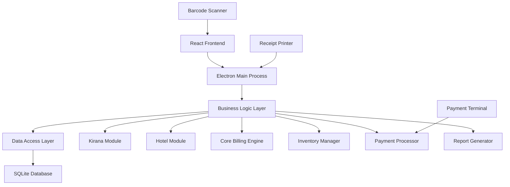

# Design Document

## Overview

The billing software will be built as a desktop application using Electron with React frontend and Node.js backend, providing a unified solution for both kirana stores and hotels. The system will use SQLite for local data storage with optional cloud sync capabilities. The architecture follows a modular design pattern where business-specific features (kirana vs hotel) are implemented as plugins while sharing core billing, inventory, and reporting functionality.

## Architecture

### System Architecture



### Technology Stack

- **Frontend**: React with TypeScript, Material-UI for components
- **Backend**: Node.js with Express for API layer
- **Desktop Framework**: Electron for cross-platform desktop app
- **Database**: SQLite for local storage with optional PostgreSQL for cloud
- **Hardware Integration**: Node.js libraries for barcode scanners and receipt printers
- **Reporting**: PDF generation with jsPDF, Excel export with ExcelJS

## Components and Interfaces

### Core Components

#### 1. Billing Engine
- **Purpose**: Central component handling all billing operations
- **Key Methods**:
  - `createBill(businessType, customerId?)`: Initialize new bill
  - `addItem(productId, quantity, customPrice?)`: Add items to current bill
  - `applyDiscount(type, value)`: Apply percentage or fixed discounts
  - `calculateTotals()`: Calculate subtotal, tax, and final total
  - `processBill(paymentMethods)`: Finalize and process payment

#### 2. Product Manager
- **Purpose**: Handle product catalog and inventory operations
- **Key Methods**:
  - `addProduct(productData)`: Add new product to catalog
  - `updateInventory(productId, quantity, operation)`: Update stock levels
  - `searchProduct(barcode | name)`: Find product by barcode or name
  - `getLowStockItems(threshold)`: Get products below minimum stock
  - `getProductsByCategory(category)`: Filter products by category

#### 3. Customer Manager
- **Purpose**: Manage customer accounts and credit transactions
- **Key Methods**:
  - `createCustomer(customerData)`: Add new customer
  - `updateBalance(customerId, amount, type)`: Update credit balance
  - `getCustomerHistory(customerId)`: Get transaction history
  - `checkCreditLimit(customerId, amount)`: Validate credit availability

#### 4. Payment Processor
- **Purpose**: Handle multiple payment methods and transactions
- **Key Methods**:
  - `processPayment(amount, methods)`: Process single or split payments
  - `validatePayment(method, amount)`: Validate payment before processing
  - `generateReceipt(billId)`: Create receipt for completed transaction
  - `refundPayment(transactionId, amount)`: Process refunds

### Business-Specific Modules

#### Kirana Store Module
- **Features**: Quick billing, barcode scanning, credit sales
- **Components**:
  - `QuickBillInterface`: Streamlined POS interface
  - `BarcodeHandler`: Barcode scanning integration
  - `CreditSalesManager`: Handle credit transactions

#### Hotel Module
- **Features**: Room billing, guest management, service charges
- **Components**:
  - `GuestManager`: Check-in/check-out operations
  - `RoomBillingEngine`: Calculate room charges by dates
  - `ServiceCatalog`: Manage hotel services and amenities

## Data Models

### Core Entities

```typescript
interface Product {
  id: string;
  name: string;
  barcode?: string;
  category: string;
  price: number;
  cost: number;
  stockQuantity: number;
  minStockLevel: number;
  taxCategory: string;
  isActive: boolean;
  businessType: 'kirana' | 'hotel' | 'both';
}

interface Customer {
  id: string;
  name: string;
  phone?: string;
  email?: string;
  address?: string;
  creditLimit: number;
  currentBalance: number;
  customerType: 'regular' | 'guest';
  isActive: boolean;
}

interface Bill {
  id: string;
  billNumber: string;
  customerId?: string;
  businessType: 'kirana' | 'hotel';
  items: BillItem[];
  subtotal: number;
  taxAmount: number;
  discountAmount: number;
  totalAmount: number;
  status: 'draft' | 'completed' | 'cancelled';
  createdAt: Date;
  completedAt?: Date;
}

interface BillItem {
  productId: string;
  productName: string;
  quantity: number;
  unitPrice: number;
  totalPrice: number;
  taxRate: number;
}

interface Payment {
  id: string;
  billId: string;
  method: 'cash' | 'card' | 'digital' | 'credit';
  amount: number;
  reference?: string;
  processedAt: Date;
}

interface HotelGuest extends Customer {
  roomNumber?: string;
  checkInDate?: Date;
  checkOutDate?: Date;
  guestCount: number;
  specialRequests?: string;
}

interface HotelService {
  id: string;
  name: string;
  category: 'room' | 'food' | 'spa' | 'laundry' | 'other';
  price: number;
  taxRate: number;
  isPerDay: boolean;
}
```

### Database Schema

The SQLite database will include the following main tables:
- `products` - Product catalog and inventory
- `customers` - Customer information and accounts
- `bills` - Bill headers and metadata
- `bill_items` - Individual items in each bill
- `payments` - Payment transactions
- `inventory_transactions` - Stock movement history
- `business_settings` - Configuration and tax settings
- `hotel_guests` - Extended customer data for hotel guests
- `hotel_services` - Hotel-specific service catalog

## Error Handling

### Error Categories

1. **Validation Errors**: Invalid input data, business rule violations
2. **Database Errors**: Connection issues, constraint violations
3. **Hardware Errors**: Barcode scanner, printer connectivity issues
4. **Payment Errors**: Payment processing failures, insufficient funds
5. **Business Logic Errors**: Inventory shortages, credit limit exceeded

### Error Handling Strategy

```typescript
class BillingError extends Error {
  constructor(
    message: string,
    public code: string,
    public category: 'validation' | 'database' | 'hardware' | 'payment' | 'business',
    public recoverable: boolean = true
  ) {
    super(message);
  }
}

// Error handling middleware
const errorHandler = (error: BillingError, context: string) => {
  // Log error with context
  logger.error(`${context}: ${error.message}`, { code: error.code, category: error.category });
  
  // Show user-friendly message
  if (error.recoverable) {
    showNotification(error.message, 'warning');
  } else {
    showErrorDialog(error.message, 'error');
  }
  
  // Attempt recovery for specific error types
  if (error.category === 'hardware') {
    attemptHardwareReconnection();
  }
};
```

## Testing Strategy

### Unit Testing
- **Framework**: Jest with React Testing Library
- **Coverage**: All business logic components, data models, and utility functions
- **Focus Areas**: Billing calculations, inventory updates, payment processing

### Integration Testing
- **Database Operations**: Test all CRUD operations with SQLite
- **Hardware Integration**: Mock barcode scanners and printers for testing
- **Business Workflows**: End-to-end testing of complete billing processes

### User Acceptance Testing
- **Kirana Store Scenarios**: Quick billing, inventory management, credit sales
- **Hotel Scenarios**: Guest check-in/out, service billing, room charges
- **Cross-Platform Testing**: Windows, macOS, and Linux compatibility

### Performance Testing
- **Database Performance**: Test with large product catalogs (10,000+ items)
- **Concurrent Operations**: Multiple simultaneous billing operations
- **Memory Usage**: Monitor Electron app memory consumption
- **Startup Time**: Ensure quick application launch

### Test Data Strategy
- **Sample Products**: Create realistic kirana and hotel product catalogs
- **Mock Customers**: Generate test customer data with various scenarios
- **Test Transactions**: Create comprehensive billing scenarios for both business types
- **Edge Cases**: Test boundary conditions, error scenarios, and recovery paths